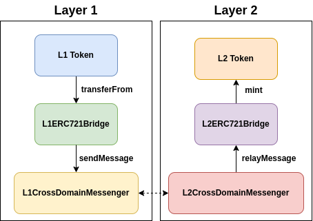

# Bridging Cross-Layer Assets

OP Sepolia Testnet is an L2 rollup, and the testing ground for OP Mainnet. As an L2 chain, anyone can bridge arbitrary data or tokens from Ethereum Sepolia L1 to OP Sepolia.

## Bridging ERC721 Tokens

Bridging an ERC721 token from Ethereum L1 is somewhat straightforward, and is done by using the [L1ERC721Bridge](https://github.com/ethereum-optimism/optimism/blob/develop/packages/contracts-bedrock/src/L1/L1ERC721Bridge.sol).

## An Exercise: Obtaining Harpy Hair

Thaddeus Blackwood has employed you to help him gather some rare materials! The first of which is hair from a harpy. Harpy Hair can be obtained from a `L2MaidenCoast` contract deployed on OP Sepolia. But entering the coast requires a Coastal Map, an ERC721 Token bridged from Ethereum Sepolia...

| Contract | Addresses |
| -- | -- |
| `LuteMaker1` | To be deployed by you on Ethereum Sepolia. | 
| `L2MaidenCoast` | `0xE346cEfd6Af024a614a543E3a30d440A2e150Bb6` on OP Sepolia. |
| `CoastalMap is ERC721` | `0x5F090550EdB24813D4fF7eEAaB4a6b81EEa0e865` on Ethereum Sepolia and `0x36e80008a0f5598a2f40760a0b07E8EF217D42ef` on OP Sepolia. |

## Your Task

Find the hair of a harpy. Then, set `hairGiven` in `LuteMaker1` to `true`!

> 💡 Upon deployment of `LuteMaker1`, you will be minted a `CoastalMap` Token on Ethereum Sepolia. This token can be bridged to OP Sepolia via OP's (`L1ERC721Bridge`)[https://github.com/ethereum-optimism/optimism/blob/op-contracts/v1.3.0/packages/contracts-bedrock/src/L1/L1ERC721Bridge.sol]!