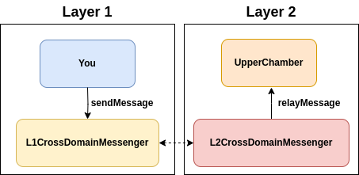

# Sending Cross-Layer Messages

Other than tokens, one can also send arbitrary messages from Ethereum Sepolia L1 to OP Sepolia L2. This is done via two contracts.

* `L1CrossDomainMessenger` on Ethereum Sepolia.
* `L2CrossDomainMessenger` on OP Sepolia.

## An Exercise: Obtaining Harpy Hairs

Thaddeus Blackwood wants the wood of a singing tree! This wood can be obtained from a `L2LonelyHill` contract deployed on OP Sepolia. But cutting a singingtree will require some L1 → L2 messages...

| Contract | Addresses |
| -- | -- |
| `LuteMaker2` | To be deployed by you on Ethereum Sepolia. | 
| `L2LonelyHill` | `0x27224FA7F9760B303d155CE5cd4de9A9fBb59EC7` on OP Sepolia. |

## Your Task

Cut down a singing tree and obtain some of its wood. Then, set `woodGiven` in `LuteMaker2` to `true`!
