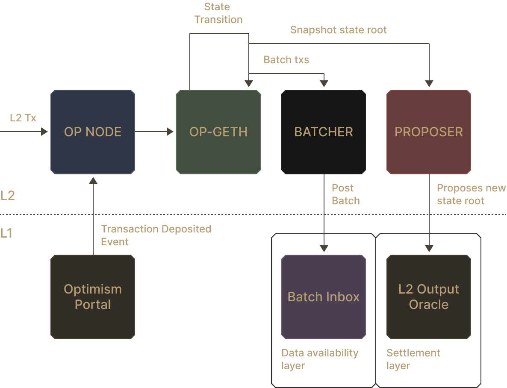
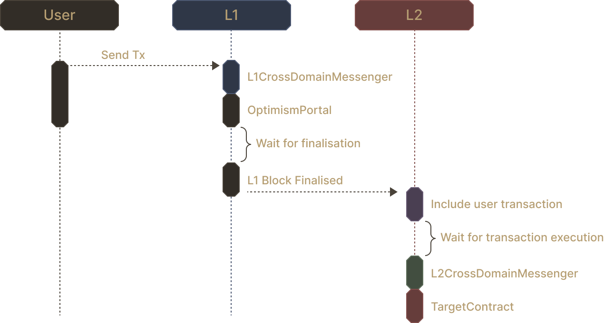
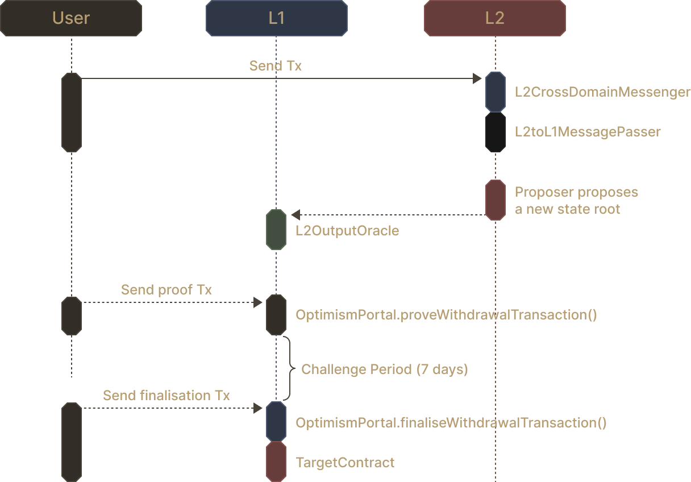
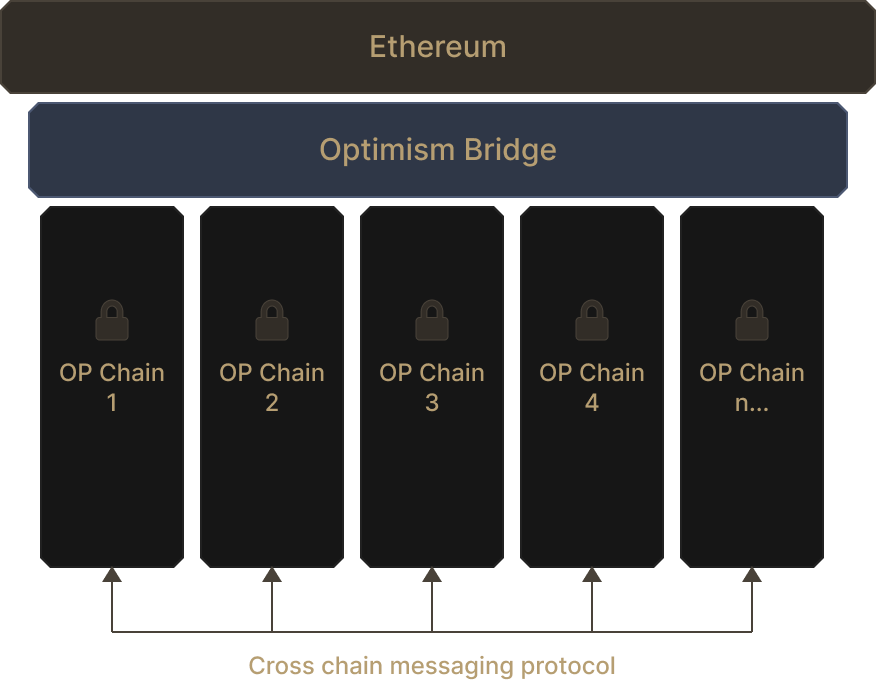

# Introduction to OP Stack

The rollup, where a fast chain settles on a slower chain, is a widely recognized method to scaling blockchains. The Optimism Collective has fully embraced this thesis, and takes it a step further: striving towards the possibility of making rollup deployment easy and accessible to all. To achieve this, the collective has introduced the OP Stack.

## What is the OP Stack?

The OP Stack is a collection of open-source software, maintained by the Optimism Collective, designed to power the Optimism ecosystem. Today, the OP stack has a central focus in providing software to deploy and maintain an OP Stack Chain.

The next question will naturally be: What is an OP Stack Chain? An OP Stack Chain is essentially an L2 EVM rollup, composed of different modular components to ensure the rollup’s functionality and security. OP Mainnet is a prime examples of an OP Stack Chain.

## Dissecting an OP Stack Chain

Let us peer into the innards of an OP Stack Chain. The chain can be thought of as a set of components, each provided by the OP Stack.

The OP Stack Chain, by default, bridges from and finalizes on Ethereum L1. This is handled by a set of contracts deployed onto Ethereum (Optimism Portal, L2 Output Oracle, etc.).

On Layer 2, a sequencer is responsible for block production and running the rollup. An OP sequencer is composed of 4 distinct entities that must work together:

1. Consensus Client (i.e., OP NODE)
2. Execution Client (i.e., OP GETH)
3. Batcher
4. Proposer

The OP Stack sequencer, by default, is operated by a single actor. A governance mechanism can then determine who may act as the sequencer at any given time. For example, a chain can rotate its sequencer among a pre-defined set of possible actors. This mechanism, like other details of the OP Stack chain, is highly modifiable. We will discuss modifications later on in the quest.

### Consensus Client

The consensus client (i.e., `op-node`) is responsible for ordering L2 blocks and transactions, which it then passes to the execution client. It can be thought of as the entity that decides the next set of inputs to transition the state of the L2 rollup.

It is also responsible for picking up deposit transactions from the L1 by listening to the [`OptimismPortal`](https://github.com/ethereum-optimism/optimism/blob/develop/packages/contracts-bedrock/src/L1/OptimismPortal.sol) contract deployed on the L1.

### Execution Client

The execution client (i.e., `op-geth`) executes blocks and transactions given by the consensus client, thereby computing the state transition of the L2 rollup. It implements the Optimism EVM, a slightly modified version of the Ethereum EVM.

After execution, the execution client sends its input transactions to the batcher, and the new state root to the proposer.

> [!TIP] The differences between Optimism’s EVM and the original Ethereum EVM are mostly trivial. You can find the exhaustive list of differences [here](https://docs.optimism.io/chain/differences).

### Batcher

The list of L2 transactions, executed by the execution client, must be made available to the public. This ensures that any external party can detect a fraudulent block and generate a fraud proof. To achieve this, the L2 transactions are batched and published onto L1.

The batcher is responsible for this action. It compresses transactions and posts EIP-4844 data blobs onto Ethereum Mainnet, directed at a `BatchInbox` address (`0xFF00…10`). The address is contract-less, and is merely an arbitrary point for receiving L2 data. Then, anyone can decode these published batches into their corresponding transactions.

### Proposer

The proposer receives execution results (i.e., L2 state roots), and relays it to the L1. The latter is done by posting the new root onto a [`L2OutputOracle`](https://github.com/ethereum-optimism/optimism/blob/develop/packages/contracts-bedrock/src/L1/L2OutputOracle.sol) contract on L1. Once the state root goes unchallenged for 7 days, it can then be considered final.

> [!TIP] The challenge window before finalization (7 days) can be subjected to change. But it is widely agreed within the Ethereum community that 7 days is the minimal period of time before a proposal can be considered unchallenged.

## Bridging Assets Between Layers

It is possible to exchange data and tokens between Ethereum L1 and OP Stack Chain L2. Specifically, users or contracts from one layer can initiate a transaction that targets an address at the other layer.

### L1 → L2 Transactions

As seen from the previous quest, an L1 to L2 transaction, called a deposit, is relatively simple. First, the L1 user or contract calls the `L1CrossDomainMessenger` to initiate a deposit. The call will internally be relayed to the L1 `OptimismPortal` contract which emits a `TransactionDeposited` event.

Then, on the L2, the consensus client (i.e., `op-node`) picks up the emitted event and adds the corresponding transaction to the list of transactions it will send to the execution client (i.e., `op-geth`). During L2 execution, the transaction will be directed to the `L2CrossDomainMessenger` contract, which will be relayed to a target address.

### L2 → L1 Transactions

An L2 to L1 transaction, called a withdrawal, is more complex and can be relatively lengthy (at least 7 days) for security reasons. First, the L2 user or contract calls the `L2CrossDomainMessenger` which, in turn, calls the `L2ToL1MessagePasser`.

Once the L2 block is posted to the L1 by the proposer as a new state root, the user has to prove the transaction inclusion in the L2 state using the SDK of their choice. This transaction can be expensive as it involves a merkle proof verification of the transaction in the nth state of the L2.

This is followed by the challenge period, putting the L1 action on standby for a period of 7 days. If the relevant state root isn’t challenged and successfully finalizes, the user can send a third and final transaction to finalize the withdrawal by calling `OptimismPortal` with the relevant information. The `OptimismPortal` will then, in turn, call the target address.

## Modifying the OP Stack Chain

The details we have expounded on thus far applies to the “vanilla” OP Stack Chain. Thanks to its open-source nature, the different components and flows of the OP Stack can be modified to fit various needs. For example, instead of using Ethereum L1 as the DA layer, a OP Stack Chain can use an alternative solution (e.g., Celestia, EigenDA) to publish L2 transaction data. Similarly, OP Stack Chains can define an alternative EVM in their execution client, or modify the L1 ↔ L2 flow we have seen!

## Joining the Superchain

Despite the seemingly limitless possibilities of hacking the OP Stack, there is a good reason to stick to the default OP Stack: to join the Superchain. The Superchain intends to be the sci-fi future of Optimism; a network of OP Stack Chains that share bridging and a joint communication layer, thereby becoming highly interoperable with each other.

This endeavor intends to maintain the parallelization of Ethereum L2’s landscape whilst improving interoperability. At the time of writing, the Superchain is still on Optimism’s roadmap. However, this is an important feature to keep in mind when deciding whether to deviate from the default OP Stack, OP Chains have to respect certain rules to be able to join the Superchain.

OP Chains that join the Superchain must also respect and comply to the overarching governance process of the Superchain. This is known as the Law of Chains. Say the Superchain’s governance votes to upgrade the OP Stack version, all OP Chain must upgrade accordingly.

## Conclusion

We have peeked into the generalized OP Stack Chain, its modifiability, and also, Optimism’s Superchain future. We have also sliced open and studied the inner workings of an OP Stack Chain, and cross-layer messaging. This information will be relevant in later quests, where we get more hands-on!